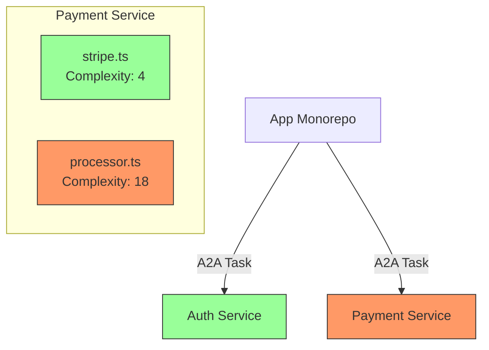

# Vibe2Vibe 🌊✨

**Automated Monorepo Refactoring & Complexity Analysis System**

**Architecture Specification | Version 1.0**

Welcome to the **Vibe2Vibe** project repository, created for the Hackathon (December 2025). This project aims to revolutionize how legacy codebases are analyzed and refactored by combining advanced cyclometric analysis with autonomous AI agents.

## 👥 Team
- **Ari**
- **Kirill**
- **Ted**

---

## 1. Executive Summary

Vibe2Vibe is an agentic web application designed to scalably refactor large codebases into decoupled microservices. It overcomes the "God Agent" hallucination problem and context window limits (100k tokens) by employing a **Multi-Agent System (MAS)** where specific agents act as "Guardians" of individual microservices.

The system relies on a hybrid protocol architecture:
*   **A2A (Agent-to-Agent):** For horizontal coordination, task delegation, and negotiation between agents (e.g., Architect Agent $\leftrightarrow$ Service Agent).
*   **MCP (Model Context Protocol):** For vertical execution, allowing agents to use tools like file system access and metric calculators (Grazer).

---

## 2. System Components

### A. The Agents (The "Guardians")
Every microservice (or repo folder) is assigned a dedicated **Service Agent**.
*   **Role:** Acts as the "Lead Developer" for that specific service.
*   **Context:** Only loads the code relevant to its service (< 100k tokens).
*   **Constraint:** Cannot edit files outside its folder. Must send **A2A Requests** to other agents for cross-service changes.
*   **Configuration**: Agents use `AGENTS.md` (or `/.well-known/agent.json`) for discovery and rule definitions.

### B. The "Grazer" Service (The "Oracle")
An objective, non-LLM service responsible for "Cyclometrics" (Cyclomatic Complexity) and validation.
*   **Input:** File paths or Git diffs.
*   **Output:** Hard metrics (Complexity Score, Token Count) and visualization data (Mermaid definitions with color-coding).
*   **Role:** Provides the "Ground Truth" to prevent agents from lying about code improvements.

### C. The Standards (Distilled IEEE)
Communication is strictly structured using JSON schemas derived from IEEE standards to prevent ambiguity.
*   **IEEE 29148 (Requirements):** Used for Feature Requests.
*   **IEEE 29119 (Testing/Defects):** Used for Bug Reports and Feedback loops.

### D. Banana Context (Demo App)
A sample application used to demonstrate Vibe2Vibe's capabilities. It analyzes products to generate infographic prompts and identifies brand mentions.

---

## 3. Communication Architecture & Workflow

This is the core differentiator. We separate "Management" (A2A) from "Labor" (MCP).

### System Architecture Diagram


### A. Horizontal: Agent-to-Agent (A2A)
**Used for:** Inter-agent delegation, negotiation, and state management.
*   **Transport:** HTTP/REST over Express.js.
*   **Discovery:** Each agent hosts an "Agent Card" at `/.well-known/agent.json` (or defined in `AGENTS.md`).
*   **Mechanism:** The **Task Resource** pattern. Agent A does not "chat" with Agent B; it creates a `Task` in Agent B's queue.

**The A2A Protocol Flow:**
1.  **Discovery:** Architect Agent scans `AGENTS.md`/registry to find `PaymentAgent`.
2.  **Task Creation:** Architect sends a POST request with an IEEE payload.
3.  **Async Updates:** `PaymentAgent` works asynchronously and sends Webhooks to the `callback_url`.

### B. Vertical: Agent-to-Tool (MCP)
**Used for:** Touching code, running commands, and checking metrics.
*   **Transport:** SSE (Server-Sent Events) managed by Mastra/Express.
*   **Scope:** Stateless execution.

**Key MCP Tools:**
*   `mcp-filesystem`: Allows the agent to read/write files in its specific directory.
*   `mcp-grazer`: Exposes the Grazer service to the LLM.
    *   *Tool Call:* `get_cyclometrics(file_path: string)`
    *   *Tool Call:* `validate_token_budget(content: string)`

### Refactoring Workflow Diagram


### The "Negotiation Loop" Workflow
We implement a "Closed-Loop" process to ensure quality. Agents must negotiate requirements before coding and verify results before merging.

#### Phase 1: Negotiation (A2A)
1.  **Architect** sends `Task` (IEEE Requirement) to **Service Agent**.
2.  **Service Agent** analyzes the request.
    *   *If ambiguous:* Sends `NEED_INFO` webhook.
    *   *If clear:* Sends `ACCEPTED` webhook.

#### Phase 2: Execution (MCP)
1.  **Service Agent** enters a coding loop:
    *   **Action:** Uses `mcp-filesystem` to apply changes.
    *   **Verification:** Uses `mcp-grazer` to check complexity.
    *   *Self-Correction:* If Grazer returns "Red" (High Complexity), the agent refactors again.

#### Phase 3: Review & Finalize (A2A)
1.  **Service Agent** sends `REVIEW_READY` webhook with a PR link/diff.
2.  **Architect** reviews output against IEEE 29119 criteria.
    *   *If Rejected:* Sends `DEFECT_REPORT`. Loop back to Phase 2.
    *   *If Approved:* Sends `APPROVAL`.
3.  **Service Agent** runs cleanup and marks Task as `COMPLETED`.

---

## 4. Technical Implementation Stack

### Core Stack
*   **Builder:** **Codex CLI** (configured with `@mastra/mcp-docs-server`).
*   **Orchestration:** **Mastra** (Node.js framework for AI).
*   **Server:** **Express.js** (Hosting the Agents and A2A endpoints).
*   **Database:** **PostgreSQL** (via `pg` vector for memory/context).

### Code Skeleton: Mastra + Express
Example configuration for a Service Agent acting as a Guardian:

```typescript
// server.ts
import express from 'express';
import { Mastra, Agent } from '@mastra/core';
import { McpClient } from '@mastra/mcp';

// 1. Setup Express
const app = express();
app.use(express.json());

// 2. Setup MCP Clients (The Tools)
const grazerClient = new McpClient({
  name: 'Grazer',
  url: 'http://localhost:4000/sse' // Grazer runs on its own port
});

// 3. Define the Service Agent
const paymentAgent = new Agent({
  name: 'PaymentServiceGuardian',
  instructions: 'You maintain the Payment microservice. You accept IEEE 29148 requests.',
  model: 'gpt-4o', 
  tools: {
    grazer: grazerClient.tool('get_cyclometrics'),
    fs: grazerClient.tool('read_file')
  }
});

const mastra = new Mastra({ agents: [paymentAgent] });

// 4. Implement A2A Endpoint (The Protocol)
app.post('/a2a/tasks', async (req, res) => {
  const { task_type, payload, callback_url } = req.body;
  
  // Validate Payload against IEEE Schema (Zod)
  if (task_type === 'IEEE_29148_REQ') {
    const taskId = `task_${Date.now()}`;
    res.json({ status: 'ACCEPTED', task_id: taskId });

    // Trigger Mastra Workflow in background
    mastra.runWorkflow('refactor_flow', { 
      agent: paymentAgent, 
      input: payload, 
      callbackUrl: callback_url 
    });
  }
});

app.listen(3000, () => console.log('Payment Agent listening on 3000'));
```

---

## 5. Visualizing Success

The final output for the user (The "Vibe" UI) is a Mermaid diagram generated by **Grazer** based on the final state of the code.

*   🟢 **Green Nodes:** Complexity < 10 (Good).
*   🔴 **Red Nodes:** Complexity > 15 (Needs Refactor).
*   🟡 **Yellow Nodes:** Context Window warning (approaching 100k).



---
*Generated for Vibe2Vibe Hackathon 2025*