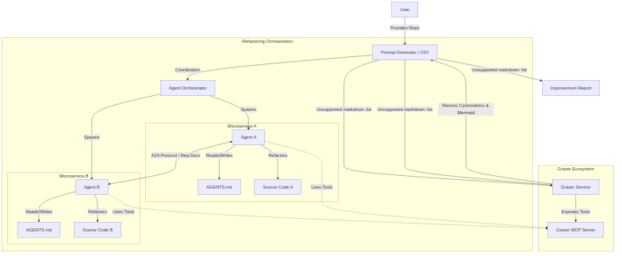
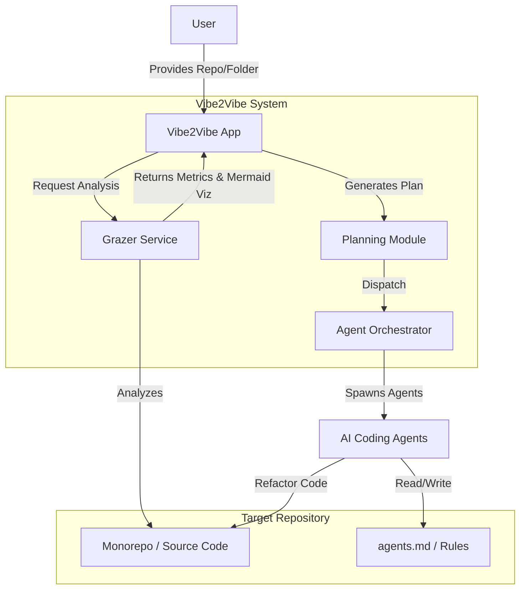
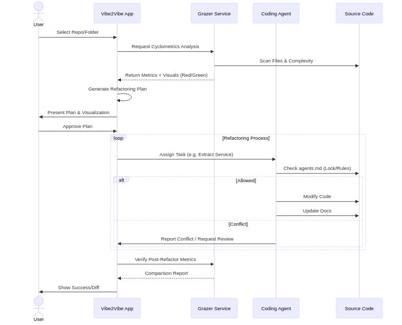
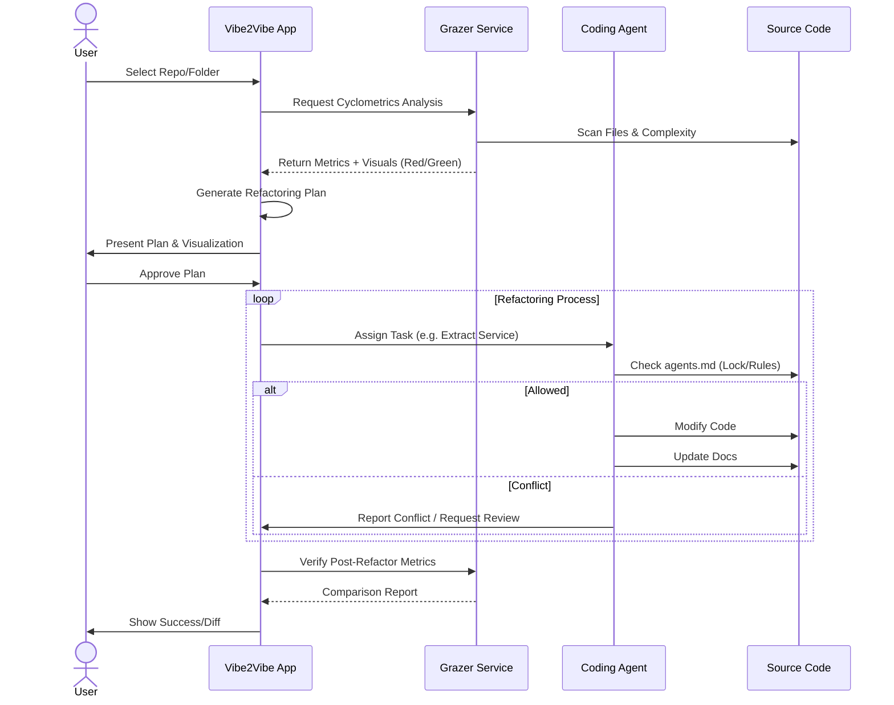

# Vibe2Vibe 🌊✨

**Automated Monorepo Refactoring & Complexity Analysis System**

Welcome to the **Vibe2Vibe** project repository, created for the Hackathon (December 2025). This project aims to revolutionize how legacy codebases are analyzed and refactored by combining advanced cyclometric analysis with autonomous AI agents.

## 👥 Team
- **Ari**
- **Kirill**
- **Ted**

---

## 🚀 Concept Overview

**Vibe2Vibe** is a web application that takes an existing code repository (monorepo or single service) and intelligently breaks it down into smaller, manageable microservices. It utilizes a specialized analysis tool called **Grazer** to assess code complexity and visualize the structure before and after refactoring.

### Core Components

1.  **Vibe2Vibe App (The Orchestrator)**:
    -   The user interface where users input their repository details.
    -   Manages the refactoring lifecycle.
    -   Generates high-level plans for splitting services.
    -   Orchestrates AI agents to perform code modifications.

2.  **Grazer (The Analyst)**:
    -   A service responsible for **Cyclometrics** (cyclomatic complexity, token counts, etc.).
    -   Operates on file, folder, and feature levels.
    -   Generates **Mermaid diagrams** visualizing the codebase structure.
    -   **Visual Feedback**: Uses color-coding (Red = High Complexity/Needs Refactor, Green = Good) to guide the process.

3.  **Banana Context (Demo App)**:
    -   A sample application used to demonstrate Vibe2Vibe's capabilities.
    -   Functionality: Analyzes products to generate infographic prompts and identifies brand mentions.

---

## 🛠️ Architecture & Workflow

### System Architecture

The system connects the user dashboard to the Grazer analysis engine and the target repository. Agents act as the bridge, applying changes based on the generated plan.

### Refactoring Workflow

1.  **Input**: User submits a repository.
2.  **Analysis**: Grazer scans the code for cyclomatic complexity and token limits.
3.  **Visualization**: A diagram is generated highlighting complex areas (Red nodes).
4.  **Planning**: Vibe2Vibe proposes a breakdown (e.g., separating "Frontend" from "Billing Service").
5.  **Execution**: Agents execute the refactor, strictly following `agents.md` protocols to avoid conflicts.
6.  **Verification**: Grazer re-scans the new structure to ensure complexity has decreased.

---

## 🛡️ Agent Safety Protocol

To prevent multiple agents from corrupting the codebase or stepping on each other's toes, we implement a **file-based locking mechanism**:

-   **`agents.md`**: A file placed in each microservice/folder.
-   **Role**: Defines which agents have jurisdiction over that directory.
-   **Process**: Before writing code, an agent reads this file. If a change involves a different scope, it must request permission or assign the task to the responsible agent.

---

## 📊 Metrics Used

-   **Cyclomatic Complexity**: Measuring logic complexity (if/else depth).
-   **Token Count**: Ensuring modules fit within LLM context windows (e.g., < 8k tokens).
-   **Visual Heatmap**:
    -   🔴 **Red**: High complexity, needs refactoring.
    -   🟢 **Green**: Healthy code, stable.

## 💻 Tech Stack
-   **Frontend/Orchestrator**: React (TypeScript/JavaScript).
-   **Analysis Engine**: Python/Node.js (Grazer).
-   **Visualizations**: Mermaid.js.
-   **Agent Framework**: (Potential) Mastra or Jumpkit.

---
*Generated for Vibe2Vibe Hackathon 2025*
